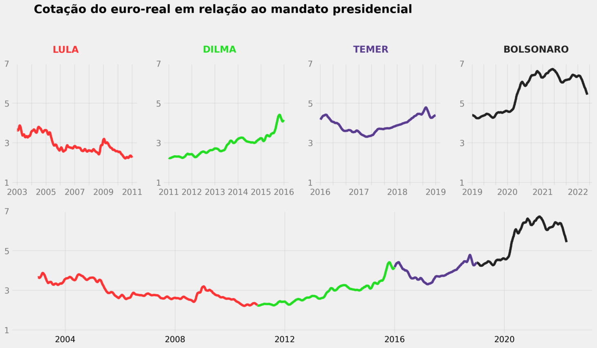

# mlops-week-04
Esse projeto analisa a variação da cotação do euro em relação ao real em relação ao mandato dos presidentes, partindo do projeto "Storytelling Data Visualization on Exchange Rates" do [dataquest.io](http://dataquest.io/), seguindo a orientação da disciplina de MLOPs.

## Fonte
Os dados foram retirados do [Kaggle](https://www.kaggle.com/datasets/lsind18/euro-exchange-daily-rates-19992020), e são os mesmos utilizados no projeto original.

## Visualização



O projeto pode também ser visualizado clonando o repositório e executando ```streamlit run ./streamlit_app.py```

## Vídeo

[Vídeo no Loom](https://www.loom.com/share/cc75948ef3c04de6aa480bf3439b56d5?sharedAppSource=personal_library)